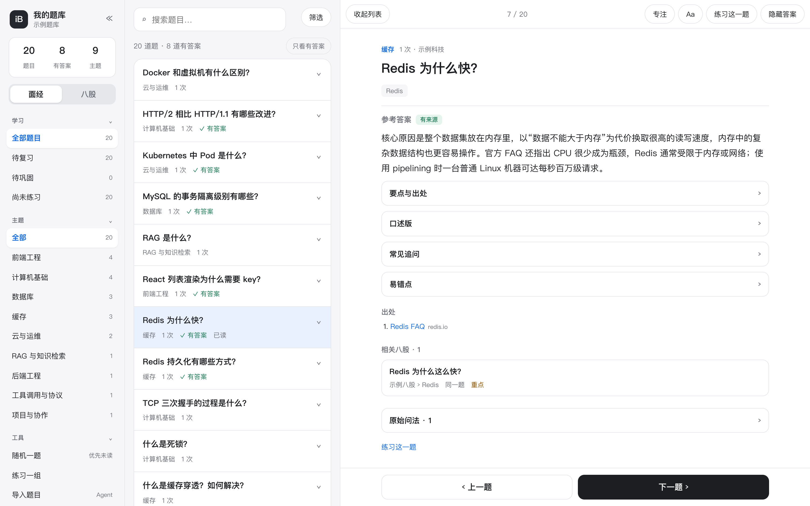
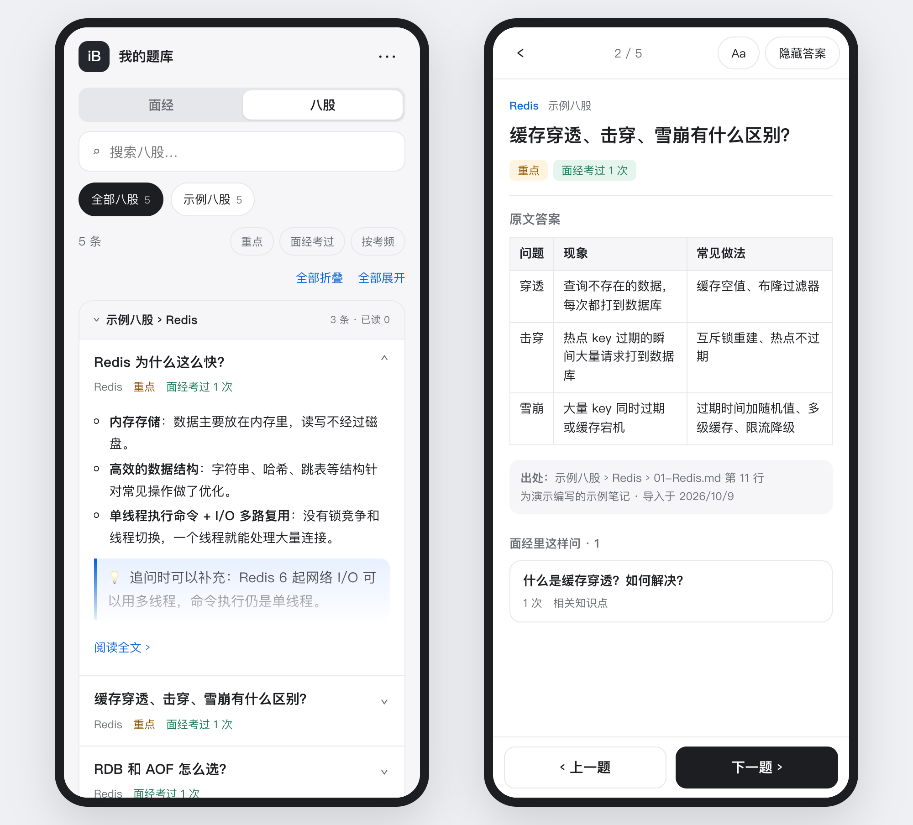

# Interview Bank Skill

English | [简体中文](README.md)

`interview-bank` is an interview-question organization Skill for Claude Code, Codex and other agents that support Agent Skills. It helps users extract questions from screenshots, selected text, web pages, recorded speech in audio/video, or subtitle transcripts collected over time, classify them by role, technical domain, technology, company and industry, merge equivalent wording, research sourced reference answers, and produce two reports for reading and self-testing. It turns scattered interview material into a growing personal reference bank.

Suitable for internships, campus recruitment, autumn recruitment and experienced-hire interviews. Current version: **1.16.0**. See the [CHANGELOG](CHANGELOG.md) and [GitHub Releases](https://github.com/EXIST-D/Interview-bank/releases).

## What's new: 1.16 a 八股 notes section, linked to your own questions

- **Import 八股 collections:** `notes import` reads a folder of Markdown study notes (one file per chapter, `##` headings as questions). The collection's answers are kept verbatim, each with its source (collection, chapter, file and line); 🔴 / ⭐ in a heading marks a key question. Notes never count as interview occurrences and do not touch dedupe or sourced answers.
- **Linked both ways:** the agent judges which notes answer each interview question (same question / related topic). In the reader, a question lists its related notes, and a note lists how interviews asked it and how often; one tap jumps between them.
- **A notes section in the Web reader:** a switch between interview questions and notes; chapters in order, with key-only, asked-only and most-asked views; lists, tables, quotes and code in answers render properly, on a phone and a computer.
- Server sync and daily backups include the notes (`collections/`). See [notes](skills/interview-bank/references/notes.md).

## 1.15 reading and practice online, on a phone or a computer

- **A Web reader redesigned for short sessions:** on a phone, a list and a full-screen reader with previous/next at the bottom, swipe and the back gesture; on a computer, three columns (navigation, list, reader) with ←/→. Each answer lists its key points with links to the sources behind them; an optional think-first mode hides answers.
- **On your own server:** the read-only reader can sit behind your own HTTPS server with its own login page (hashed passwords, 14-day sessions, lockout after repeated failures); `--banks-dir` gives several people one account and one bank each. `tools/deploy/sync.sh` copies the bank there from your computer (no screenshots), with daily verified backups.
- **Deployment templates:** `tools/deploy/` holds the systemd units, nginx snippets and the account, sync and backup scripts; steps are in [local Web usage](skills/interview-bank/references/web.md).
- Local use is unchanged: `web` still opens on your computer only, with the same new interface and no login.

Details are in the [CHANGELOG](CHANGELOG.md). The local Web interface is described in [local Web usage](skills/interview-bank/references/web.md).

## Interface preview

On a computer: navigation, question list and reader in three columns.



On a phone: the question list and the full-screen reader with previous/next.



Both come from the `demo` sample bank (synthetic questions, fictional companies); anyone can reproduce them with `demo --bank <new dir>` and `web`.

## Repository layout

```text
Interview-bank/
├── README.md / README.en.md
├── CHANGELOG.md                  # version history
├── CONTRIBUTING.md / SECURITY.md
├── LICENSE
├── .github/workflows/ci.yml      # tests on Windows/macOS/Linux × Python 3.10–3.13, lint, legacy-format run, package check
├── tests/                        # standard-library unittest suite (not installed with the Skill)
├── evals/                        # evaluation datasets, scorer, recorded runs, host verification
├── tools/                        # packaging, release checks, synthetic fixtures, measurements, eval runners, server deployment (deploy/)
├── examples/                     # sample structured answer
├── assets/readme/                # README images, not installed
└── skills/
    └── interview-bank/           # the installable Skill
        ├── SKILL.md
        ├── LICENSE.txt
        ├── agents/openai.yaml
        ├── assets/web/           # local Web reader (HTML/CSS/JS, no build step)
        ├── references/           # protocols for each step
        └── scripts/
            ├── ibank.py          # CLI entry point
            └── ibank_core/       # data engine
```

## Capabilities

| Step | What it does |
|---|---|
| Intake | Screenshots, selected text, web page bodies, audio and video speech, SRT/VTT/TXT/JSON subtitles (including Bilibili and YouTube auto-captions); identical files never add frequency |
| Extraction | The agent reads images or transcripts, keeping original wording, follow-up links, company/round/date; low confidence and contact details become review items |
| Classification | 67 roles, 186 domains, 229 technologies, 83 industries; Chinese labels, aliases, multiple labels, hierarchical filters |
| Deduplication | Candidate retrieval (boilerplate removed, common English terms mapped) plus the agent's semantic judgment; uncertain pairs can go to the user in the Web reader |
| Reference answers | Primary sources read and mapped per key point; optional verified quotes; `answer-recheck` for wording-only changes |
| Reports | Two Markdown editions plus a JSON sidecar; JSON/JSONL/CSV/Anki exports; English or Chinese |
| Maintenance | V2 personal state, field protection, never-merge rules, research workflows, undo, change-set runs, `gc`, standalone backup and restore |
| Preparation | JD topics with coverage gaps, daily plan calendars, review queues (simple or FSRS), one-question-at-a-time mock interviews |
| Local Web | Browse, filter, self-rated practice, human review, merge decisions; English and Chinese, dark mode |

## Agent capabilities and requirements

The Skill uses the agent's vision, reasoning and web tools and is not tied to one model API. The agent understands material and researches answers; the Python CLI validates, stores transactionally, queries and exports.

- Python **3.10 or newer**; the core and subtitle parsing use only the standard library. Local transcription of raw audio/video optionally uses `faster-whisper==1.2.1`.
- The agent must view local images, read and write the files the user allows, and run Python; sourced answers need web search and page reading.
- Installing with `npx` needs Node.js/npm; the Python core does not.
- Keep banks and outputs outside the installed Skill directory.
- The CLI does not go online by default; only `verify-citations` (link checks, on request) and `page-text` (saving cited pages while researching answers) make network requests.

## Installation

If you are not familiar with installation commands, tell your agent:

> Please install this Skill for me: [https://github.com/EXIST-D/Interview-bank](https://github.com/EXIST-D/Interview-bank), and give me a short introduction.

The Skill is listed on [skills.sh](https://skills.sh/exist-d/interview-bank/interview-bank). Install with the `skills` CLI (Codex shown):

```powershell
npx skills add EXIST-D/Interview-bank --skill interview-bank --agent codex --yes --copy
```

Other agents use the same command with their `--agent` value (paths from the [skills CLI](https://github.com/vercel-labs/skills); add `-g` for a user-wide install):

| Agent | `--agent` | Project path | Global path | How to invoke |
|---|---|---|---|---|
| Claude Code | `claude-code` | `.claude/skills/` | `~/.claude/skills/` | Natural language; matched by the Skill description |
| Codex | `codex` | `.agents/skills/` | `~/.codex/skills/` | `$interview-bank …` or natural language |
| Cursor | `cursor` | `.agents/skills/` | `~/.cursor/skills/` | Natural language |
| Trae / Trae CN | `trae` / `trae-cn` | `.trae/skills/` | `~/.trae/skills/` / `~/.trae-cn/skills/` | Natural language |
| Qwen Code | `qwen-code` | `.qwen/skills/` | `~/.qwen/skills/` | Natural language |
| Gemini CLI | `gemini-cli` | `.agents/skills/` | `~/.gemini/skills/` | Natural language |

What has actually been verified on each host is recorded in [host verification](evals/host-verification.md). You can also copy `skills/interview-bank` into your agent's skills directory, or download the checksummed ZIP from [Releases](https://github.com/EXIST-D/Interview-bank/releases). Reload the project or restart the client if the skill list does not refresh.

## Try it

```text
python -B <skill dir>/scripts/ibank.py demo --bank <new dir>
python -B <skill dir>/scripts/ibank.py web --bank <new dir> --open
```

`demo` builds 20 synthetic questions, 8 with reference answers checked against official documentation.

## Examples

```text
Use interview-bank to organize these interview screenshots, classify and merge equivalent questions, add sourced reference answers, and produce both reports.

Organize the questions only; no answers. Leave out self-introductions.

Add this interview write-up page to my bank (I have it open).

Find the most frequent Redis backend questions in my bank and add answers backed by official documentation.

From this job description, pick 30 questions from my bank, explain coverage and gaps, export both reports and plan 10 a day.

Ask me 10 questions from this topic one at a time, give feedback after each answer and summarize weak areas at the end.

Export my bank as Anki cards.

Open the local Web reader; I want to review answers myself and settle the uncertain merges.
```

## Local Web reader and practice

> Use interview-bank to open the local Web reader for my bank so I can browse and practise.

```text
python -B <skill dir>/scripts/ibank.py web --bank <existing bank> --open
```

The server listens on the loopback interface only (`127.0.0.1` or `localhost`); use the full launch URL it prints, stop it with Ctrl+C, and add `--read-only` to disable all writes. The page offers filters and search, answers and original wording, self-rated practice (saved in V2 banks; a round survives a reload), **human review** (only you can press it), **merge decisions** (you settle the merges the agent was unsure about), English or Chinese and dark mode. It runs no AI and does not grade answers.

**Reading on a phone (optional):** the read-only reader can sit behind your own HTTPS server and a login; `tools/deploy/sync.sh` copies the bank data there (no screenshots). Steps and templates: [local Web usage](skills/interview-bank/references/web.md) and `tools/deploy/`.

## Processing policy

Default flow: **extract → classify → deduplicate → commit → research reference answers → export both reports**.

- Similarity only finds candidates; the agent decides merges from the full meaning and hands uncertain ones to the user. Languages, versions, scenarios and complexity constraints are never dropped to shrink the count.
- Answers prefer official documentation, original papers and first-party sources, with every key point mapped to a citation. "Verified against sources" and "human-reviewed" are different states; only the user can create the latter.
- Before researching more than 20 questions the agent tells you the count and batches and lets you choose all, only the most frequent, or the question edition first.
- Work runs in batches of 5–10, deduplicated before research; both editions render from the same data.
- A questions-only request skips research; queries, exports or Skill changes never start a bank-wide research run.

## Generated bank and reports

```text
<bank directory>/
├── manifest.json / config.json
├── data/                         # questions, occurrences, sources, companies, answers, relations; V2 adds state.json
├── runs/                         # task packets, stages (change sets), commit receipts and audit
├── media/                        # retained source copies when chosen
├── backups/                      # verified backups from backup create and migrations
└── exports/
    ├── 面试题整理报告.md
    ├── 面试题整理报告（题目版）.md
    └── 面试题整理报告.md.details.json
```

- **Answer edition:** topic overview at the top; each question has its reference answer, source links, frequency, companies, labels and evidenced years; spoken version, follow-ups and pitfalls are folded.
- **Question edition:** the same questions and order without answers, for self-testing.
- **Structured sidecar:** internal IDs, original wording, exact dates, source links, full classification and answer history.

The JSONL files in `data/` are the only source of truth and are queried directly; every change goes through stage, validation and commit with history and audit. Frequency counts collected occurrences, not interview participants or market probabilities.

## Status and plans

**v1.16.0** implements everything in the capabilities table above. Existing V1 banks keep extraction, classification, deduplication, answer research and export; saved topics, durable research workflows and review state need a backed-up upgrade to V2. Updating the Skill never migrates a personal bank or marks old answers as re-verified.

**Not implemented yet:**

| Area | Note |
|---|---|
| On-screen text in videos | Only speech is processed; capture silent on-screen questions as screenshots |
| Speaker separation, resuming inside long recordings | Speaker labels from the tool are kept; resume is per file |
| Editing in the Web reader | Question edits and intake stay with the agent; the Web reader reads, practises, reviews and decides merges |
| MCP server | Planned as a separate optional package; the core stays dependency-free |

**Other limits:** review queues are generated on demand with no background reminders; exact token and cost figures depend on the host; splitting an arbitrary historical merge is not supported, only undoing the latest eligible operation.

**Verification:** v1.16.0 passes 315 automated tests in CI (Windows, macOS and Linux; Python 3.10–3.13), runs them again in the legacy snapshot format, and adds lint and a packaged-install check; run them with `python -B -m unittest discover -s tests`. Evaluation results and host checks are in [evals](evals/README.md): dedupe retrieval recall@10 is 1.00; blind dedupe judgments made 0 % false merges and 3.4 % missed merges (Opus and Sonnet); blind answers scored 1.7 / 2 from a separate judge with no unsupported claims; on Claude Code the trigger suite passes with Sonnet, while Haiku's recall (0.73–0.80) is below the gate. Extracted content and reference answers still need checking against the original material, sources and scope.

The repository contains the Skill, tests, evaluations and development tools, documentation, license and the README image. Personal material, banks, research ledgers and local environments are not published; test and evaluation data are synthetic.

## Author and maintenance

Created and maintained by [EXIST-D](https://github.com/EXIST-D).

Issues, feedback and suggestions are welcome in [GitHub Issues](https://github.com/EXIST-D/Interview-bank/issues); see [CONTRIBUTING](CONTRIBUTING.md), and [SECURITY](SECURITY.md) for vulnerabilities. Remove personal information, private screenshots and sensitive bank content from any example you submit.

## License

This repository uses the **MIT License**; see [LICENSE](LICENSE). The Skill also ships a copy: [skills/interview-bank/LICENSE.txt](skills/interview-bank/LICENSE.txt).

The license covers this repository's code and documentation; screenshots, question material and cited third-party sources remain subject to their own rights and terms.
