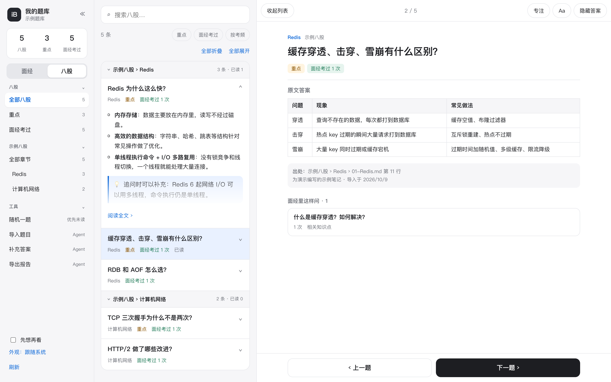

# Interview Bank Skill

[English](README.en.md) | 简体中文

`interview-bank` 是一个面向 Claude Code、Codex 等支持 Agent Skills 的 Agent 的面试题整理 Skill。它可以帮助用户从碎片化搜集的面试题目截图、已选好的文字、网页、音视频中的语音或字幕转写稿中提取面试题，按岗位、技术领域、技术栈、公司和行业分类，合并同义问法，研究有来源支持的参考答案，并生成适合阅读和自测的两份报告，帮助用户将碎片化的面试题目积累成个人的面试题目参考库。

适用于校招、实习、秋招和社招。当前版本为 **1.16.0**。详见 [更新记录](CHANGELOG.md) 与 [GitHub Releases](https://github.com/EXIST-D/Interview-bank/releases)。

## 本次更新：1.16 八股板块 + 更好用的网页阅读器

- **八股板块**：把收集到的公开八股题库（一个文件夹的 Markdown，每个文件一章、`##` 标题为题目）用 `notes import` 导入。原文答案逐字保留并标注出处（题库、章节、文件和行号），🔴 / ⭐ 标记识别为重点。八股不计入面经出现次数，不影响去重和参考答案。详见 [八股说明](skills/interview-bank/references/notes.md)。
- **面经与八股互相关联**：Agent 逐题判断每道面经题对应哪些八股条目（同一题 / 相关知识点）。网页里，面经题下列出"相关八股"，八股条目下列出"面经里这样问"和被问过的次数，一点即可来回跳转；"面经考过""按考频"帮你先背最常被问的。
- **网页阅读器全面升级**：八股按章节分组、可折叠（全部折叠即是目录）；列表里直接速览答案；已读标记与章节进度；随机一题；电脑上导航和列表都能收起，"专注"全屏阅读；字号、阅读进度条、浅色 / 深色主题。详见下文 [网页阅读器](#网页阅读器电脑和手机上随时刷题)。
- 服务器同步和每日备份都包含八股（`collections/`）。

## 1.15 手机和电脑上的在线阅读

- 网页按"碎片时间阅读"重新设计：手机上列表 + 全屏阅读，电脑上三栏；答案的每个要点都能点开它依据的原始资料。
- 只读阅读器可以部署在自己的 HTTPS 服务器上：独立登录页、多账号（每人一个题库）、每日校验备份；`tools/deploy/` 提供全部模板。

## 界面示例

电脑上：导航、题目列表和阅读区三栏；面经题下面列出相关八股。


八股板块：按章节分组、可折叠，列表里直接速览答案；阅读页显示原文答案、出处，以及面经里怎么问。



手机上：章节目录与速览（左），全屏阅读与上一题 / 下一题（右）。


截图都来自 `demo` 示例题库（合成题目、虚构公司、为演示编写的八股），任何人都可以用 `demo --bank <新目录>` 和 `web` 复现。

## 仓库结构

```text
Interview-bank/
├── README.md / README.en.md
├── CHANGELOG.md                  # 版本记录
├── CONTRIBUTING.md / SECURITY.md
├── LICENSE
├── .github/workflows/ci.yml      # Windows/macOS/Linux × Python 3.10–3.13 测试、lint、旧格式回归与安装包检查
├── tests/                        # 标准库 unittest 测试（不随 Skill 安装）
├── evals/                        # 评测数据集、打分脚本、评测记录与宿主验证记录
├── tools/                        # 打包、发布检查、合成夹具、度量、评测运行器与服务器部署模板（deploy/）
├── examples/                     # 结构化答案样例
├── assets/readme/                # 主页示意图，不随 Skill 安装
└── skills/
    └── interview-bank/           # 可安装的 Skill 本体
        ├── SKILL.md
        ├── LICENSE.txt
        ├── agents/openai.yaml
        ├── assets/web/           # 本地 Web 页面（HTML/CSS/JS，无构建步骤）
        ├── references/           # 各环节协议
        └── scripts/
            ├── ibank.py          # CLI 入口
            └── ibank_core/       # 数据引擎
```

## 功能范围

| 环节 | 能做什么 |
|---|---|
| 素材入库 | 截图、已选文字、网页正文、录音与视频音轨、SRT/VTT/TXT/JSON 字幕（含 B 站与 YouTube 自动字幕）；相同文件不重复计数 |
| 抽取 | Agent 看图或阅读转写稿，保留原文、追问关系、公司/轮次/日期；低置信度与联系方式会成为审阅项 |
| 分类 | 67 类岗位、186 个技术领域、229 个技术标签、83 个行业，支持中文名、别名、多标签与层级筛选 |
| 去重 | 候选检索（去除问句套话、常见英文术语映射）+ Agent 语义判断；不确定的可交给用户在 Web 中裁决 |
| 参考答案 | 搜索并阅读一手资料，按要点映射来源；可附原文摘录并校验；措辞变化时用 `answer-recheck` 低成本复核 |
| 报告 | 带答案与纯题目两版 Markdown + 结构化附件；JSON/JSONL/CSV/Anki 导出；可切换英文 |
| 持续维护 | V2 个人状态、字段保护、禁止合并、研究工作流、撤销、增量快照、`gc` 清理、独立备份与恢复 |
| 备考 | JD 专题选题与覆盖缺口、每日计划日历、复习队列（简单间隔或 FSRS）、逐题模拟面试 |
| 八股板块 | 导入收集的 Markdown 八股题库，原文答案标注出处；Agent 判断与面经题的关联，网页里双向跳转 |
| 网页阅读器 | 面经 / 八股两个板块，速览、已读、随机一题、章节折叠、专注阅读；练习自评、人工审阅、合并裁决；可部署到自己的服务器在手机上看 |

## Agent 能力与环境要求

本 Skill 使用 Agent 的看图、推理和联网工具，不绑定某一家模型 API。Agent 负责理解材料和研究答案，Python CLI 负责数据校验、事务入库、查询与导出。

- Python **3.10 或更高版本**；核心与字幕解析只使用标准库。原始音视频的本地转写可选安装 `faster-whisper==1.2.1`。
- Agent 能查看本地图片、读写用户授权的文件，并执行 Python 命令；生成有来源的答案时需要搜索和读取网页。
- 通过 `npx` 安装时需要 Node.js/npm；Python 核心工具本身不依赖 Node.js。
- 题库与输出目录应位于已安装 Skill 目录之外。
- CLI 默认不联网；只有用户要求时运行的 `verify-citations`（检查引用链接）和研究答案时的 `page-text`（保存引用页面正文）会访问网络。

## 安装方式

如果不熟悉安装命令，可以直接告诉你的 Agent：

> 请你为我安装这个 [https://github.com/EXIST-D/Interview-bank](https://github.com/EXIST-D/Interview-bank) Skill，并且进行简要介绍。

可在 [skills.sh 的 interview-bank 页面](https://skills.sh/exist-d/interview-bank/interview-bank) 查看本 Skill。使用 `skills` CLI 安装（以 Codex 为例）：

```powershell
npx skills add EXIST-D/Interview-bank --skill interview-bank --agent codex --yes --copy
```

其他 Agent 替换 `--agent` 即可（路径来自 [skills CLI](https://github.com/vercel-labs/skills)，加 `-g` 为全局安装）：

| Agent | `--agent` | 项目目录 | 全局目录 | 调用方式 |
|---|---|---|---|---|
| Claude Code | `claude-code` | `.claude/skills/` | `~/.claude/skills/` | 自然语言，按 Skill 描述自动匹配 |
| Codex | `codex` | `.agents/skills/` | `~/.codex/skills/` | `$interview-bank …` 或自然语言 |
| Cursor | `cursor` | `.agents/skills/` | `~/.cursor/skills/` | 自然语言 |
| Trae / Trae CN | `trae` / `trae-cn` | `.trae/skills/` | `~/.trae/skills/` / `~/.trae-cn/skills/` | 自然语言 |
| Qwen Code | `qwen-code` | `.qwen/skills/` | `~/.qwen/skills/` | 自然语言 |
| Gemini CLI | `gemini-cli` | `.agents/skills/` | `~/.gemini/skills/` | 自然语言 |

各宿主的实际验证情况记录在 [宿主验证记录](evals/host-verification.md)。也可以把 `skills/interview-bank` 整个目录复制到所用 Agent 的技能目录，或从 [Releases](https://github.com/EXIST-D/Interview-bank/releases) 下载带校验值的 ZIP。若客户端没有刷新技能列表，请重新加载项目或重启客户端。

## 快速体验

```text
python -B <Skill目录>/scripts/ibank.py demo --bank <新目录>
python -B <Skill目录>/scripts/ibank.py web --bank <新目录> --open
```

`demo` 生成 20 道合成题（8 道附有核对过官方文档的参考答案）和一小套为演示编写的八股（5 条，已与题目关联），可以直接浏览、导出和练习。

## 使用示例

```text
使用 interview-bank 整理这些面试题截图，自动分类和合并同义题，补充有来源的参考答案，输出带答案和纯题目两份报告。

只整理题目，不生成答案；排除自我介绍等纯个人问题。

这篇牛客面经帮我整理进题库（我已经打开了这个页面）。

请找出已有题库中后端 Redis 的高频题，补充官方资料支持的参考答案。

根据这份 JD，从个人题库中选出 30 道相关题，说明覆盖和缺口，生成两份专题报告，并安排成每天 10 题的计划。

从这个专题问我 10 题，每次一题；我回答后给出反馈，结束时总结薄弱点。

把题库导出成 Anki 卡片。

打开本地 Web，我想自己审一下答案，也处理一下不确定的合并。
```

完整模板：

```text
使用 interview-bank，整理“<截图输入目录>”中的全部面试题截图，
将题库和整理结果保存到“<输出题库目录>”。

输入文件仅供读取，所有新文件写入输出题库目录，不要修改已安装的 Skill。

请根据题意自动分类，合并同义题与兼容补充问法，保留原题和出处；
排除自我介绍等纯个人问题，不要猜测无法确认的公司、年份或模糊文字。

为去重后的题目搜索并读取可信资料，核对结论和适用条件，
将答案凝练为简短要点，标注“答案（参考）”并附来源。

输出带答案和纯题目两份 Markdown 报告，以及完整结构化附件。
请分批保存和提交，完成后说明题目数量、答案覆盖、输出文件及未解决事项。
```

## 网页阅读器：电脑和手机上随时刷题

Agent 负责把题目整理进题库，网页负责"读"。页面不调用 AI、不联网检索，只读取你的题库。

- **两个板块**：「面经」是你积累的真实面试题，按出现次数排序，配有出处可查的参考答案；「八股」是你收集的公开题库，按章节顺序阅读，原文答案标注出处。两边互相关联，一点即可来回跳转。
- **为碎片时间设计**：手机上列表 + 全屏阅读，底部上一题 / 下一题，也可以左右滑动；列表里每题可展开速览答案；打开过的题记为已读，章节标题显示进度；"随机一题"优先挑没读过的；"先想再看"默认隐藏答案。
- **电脑上三栏**：导航、列表、阅读区。导航和列表都能收起，"专注"让阅读区占满窗口，正文保持舒适的行宽。
- **读得舒服**：三档字号、阅读进度条、浅色 / 深色 / 跟随系统、搜索词高亮；长答案里的表格、代码、引用和多级列表都正常排版。已读、折叠、字号和外观保存在当前浏览器。
- **练习与把关**（本机运行时）：练习自评（V2 题库保存进度并安排复习）、对答案做**人工审阅**、对 Agent 不确定的合并做**裁决**，这些只能由你本人在页面上点击完成。

| 快捷键（电脑） | 作用 |
|---|---|
| ← / → 或 K / J | 上一题 / 下一题 |
| 空格 | 显示答案（"先想再看"时） |
| / | 搜索 |
| F | 专注阅读（收起导航和列表） |
| L | 收起 / 展开列表 |
| Esc | 退出专注 |

### 三种使用方式

| 方式 | 适合 | 怎么做 |
|---|---|---|
| **本机打开** | 只在自己电脑上用 | `python -B <Skill目录>/scripts/ibank.py web --bank <题库目录> --open`。只监听本机（127.0.0.1），不需要登录，Ctrl+C 停止，`--read-only` 禁用写入。也可以直接对 Agent 说"打开我的题库网页"。 |
| **部署到自己的服务器** | 想在手机上随时看 | 只读阅读器放在你自己的 HTTPS 反向代理后面：独立登录页（密码只存摘要、连续输错锁定）、多账号各看各的题库、每日校验备份。题库用 `tools/deploy/sync.sh` 从本机同步，只传题库文本和八股，不传截图。步骤见 [Web 说明](skills/interview-bank/references/web.md) 与 `tools/deploy/`。 |
| **联系作者一起测试** | 想先试试在线版，或暂时不方便自己部署 | 通过 [GitHub Issues](https://github.com/EXIST-D/Interview-bank/issues) 联系作者，开通一个账号一起测试。每个账号只能看到自己的题库；服务器上只保存题库文本（不含截图），可以随时要求删除。 |

## 处理策略

默认流程：**提取 → 分类 → 去重 → 提交 → 研究参考答案 → 导出两版报告**。

- 相似度只用于寻找候选，是否合并由 Agent 结合完整题意判断；不确定时交给用户。不会为了减少数量而丢掉语言、版本、场景或复杂度约束。
- 答案优先使用官方文档、原始论文和第一方资料，每个要点映射来源；“已核验来源”与“已人工审阅”是不同状态，后者只能由用户本人产生。
- 研究超过 20 题前，Agent 会先告诉你题数和批次，让你选择全部研究、只研究高频题或先出题目版。
- 通常按 5—10 题分批处理，先去重再研究；两版报告由同一份数据渲染，不需要再次生成答案。
- 只整理题目时跳过答案研究；单独查询、导出或修改 Skill 不会触发全库研究。

## 生成题库与报告

```text
<输出题库目录>/
├── manifest.json / config.json
├── data/                         # 题目、出现记录、来源、公司、答案、关系；V2 另有 state.json
├── runs/                         # 任务包、暂存（增量变更集）、提交回执与审计
├── media/                        # 选择复制保留时的原始素材
├── backups/                      # backup create 与迁移生成的校验备份
└── exports/
    ├── 面试题整理报告.md
    ├── 面试题整理报告（题目版）.md
    └── 面试题整理报告.md.details.json
```

- **参考答案版**：顶部汇总领域题数；每题包含参考答案、资料链接、出现次数、公司、标签和有依据的年份；口述版、常见追问与易错点折叠展示。
- **题目版**：与答案版题目和顺序一致，去掉答案，便于自测。
- **结构化附件**：保留内部 ID、原题、精确日期、来源关联、完整分类与答案历史。

`data/` 中的 JSONL 是唯一事实来源，查询直接读取；所有修改都经过暂存、校验和提交，保留历史与审计。出现次数代表搜集记录，不代表面试人数或真实市场概率。

## 当前状态与计划

**v1.16.0** 已实现上面“功能范围”表中的全部能力。已有 V1 题库可继续使用提取、分类、去重、答案研究与导出；保存专题、持久研究工作流和复习状态需要先备份并升级到 V2。更新 Skill 不会自动迁移个人题库，也不会把旧答案标记为重新核验。

**尚未实现：**

| 方向 | 说明 |
|---|---|
| 视频画面题目提取 | 只处理视频语音；画面中未被念出的文字需另行截图 |
| 说话人分离与长录音断点续转 | 可保留工具提供的说话人信息，按文件恢复 |
| Web 内编辑 | 题目编辑与素材导入仍由 Agent 完成；Web 负责阅读、练习、审阅和合并裁决 |
| 跨设备同步阅读进度 | 已读、折叠等记录目前只保存在当前浏览器；部署到服务器时练习自评暂不回传本机 |
| MCP 形态 | 计划作为独立可选包，核心保持零依赖 |

**其他边界：**复习队列按需生成，没有后台提醒；精确 Token 和费用统计依赖宿主；任意历史合并的拆分尚不支持，仅支持满足条件的最近操作撤销。

**验证情况：** v1.16.0 在 CI 中通过 315 项自动化测试（Windows、macOS、Linux；Python 3.10–3.13），另以旧快照格式回归一遍，并做 lint 与安装包检查；可用 `python -B -m unittest discover -s tests` 自行运行。评测结果与宿主验证见 [evals](evals/README.md)：去重召回 recall@10 为 1.00；盲测的去重判断误合并 0%、漏合并 3.4%（Opus、Sonnet）；盲测答案经独立评审平均 1.7/2，无无依据断言；Claude Code 上 Sonnet 的触发评测达标，Haiku 召回 0.73–0.80 未达标。识别结果与参考答案仍需结合原文、来源和适用条件核对。

仓库包含 Skill、测试、评测与开发工具、介绍、许可证及本页示意图。个人素材、题库、答案研究记录和本地依赖环境不随仓库发布；测试与评测数据均为合成数据。

## 作者与维护

本项目由 [EXIST-D](https://github.com/EXIST-D) 创建并维护。

欢迎通过 [GitHub Issues](https://github.com/EXIST-D/Interview-bank/issues) 提交问题、使用反馈或改进建议，流程见 [CONTRIBUTING](CONTRIBUTING.md)；安全问题见 [SECURITY](SECURITY.md)。提交示例时请先移除个人信息、私有截图和敏感题库内容。

## 许可证

本仓库使用 **MIT License**，详见 [LICENSE](LICENSE)。Skill 内部也包含一份许可证副本：[skills/interview-bank/LICENSE.txt](skills/interview-bank/LICENSE.txt)。

许可证适用于本仓库的代码和说明；用户输入的截图、题库材料以及引用的第三方资料仍遵循各自的权利与使用条件。
